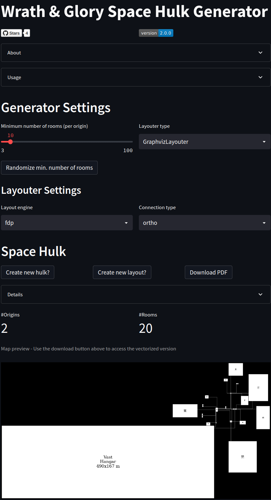

# Wrath & Glory Space Hulk Generator

The _Wrath & Glory Space Hulk Generator_ contains a random map generator for [Cubicle7](https://cubicle7games.com)'s
Warhammer
40k role-playing
game _[Wrath & Glory](https://cubicle7games.com/our-games/wrath-glory)_.

## State

Active Development

## Description

The code contains the generator as well as a streamlit app for a simple website hosting the generator that can be found
[here](https://share.streamlit.io/lordfckhelmchen/wrath-and-glory-space-hulk-generator/main).

A description of the app is given in [APP_ABOUT.md](docs/APP_ABOUT.md).

### Use Cases

An initial analysis of the use cases for the generator is given in [USE_CASES.md](docs/USE_CASES.md).

## Installation

Currently, there is no stand-alone installation. To locally use the project, e.g. for making code changes,

1. Install the external dependencies from [packages.txt](packages.txt) (e.g. the graphviz backend)
2. Install the Python dependencies via [poetry](https://python-poetry.org) from [pyproject.toml](pyproject.toml)
3. Run the app via `poetry run streamlit run streamlit_app.py` from the repository root

## Contributing

If you have any improvement suggestions or feature requests or if you found bugs, simply open
an [issue](https://github.com/LordFckHelmchen/wrath-and-glory-space-hulk-generator/issues).

Or event better create
a [pull request](https://github.com/LordFckHelmchen/wrath-and-glory-space-hulk-generator/pulls) (PR) with the
recommended code change.
If you create a PR, Please make sure to add/update the [unittests](tests) accordingly.

## License

See [LICENSE](LICENSE)
