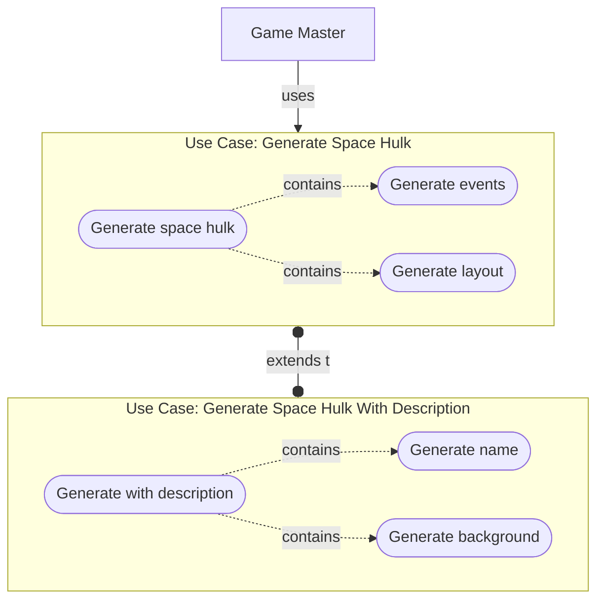
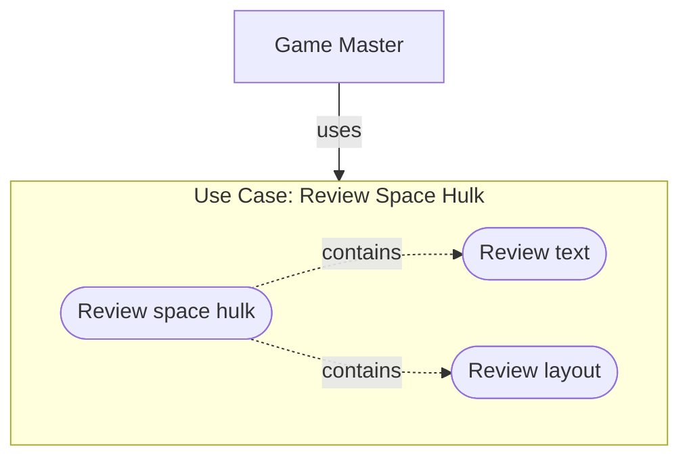
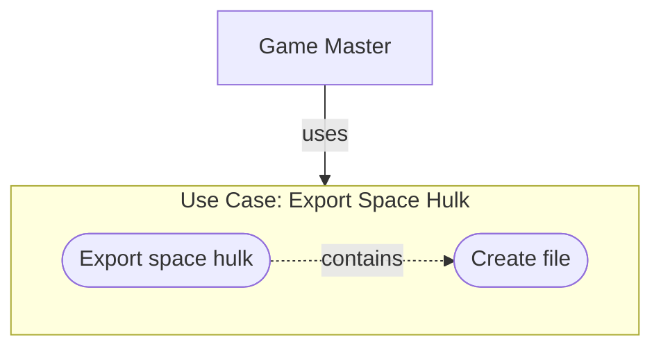
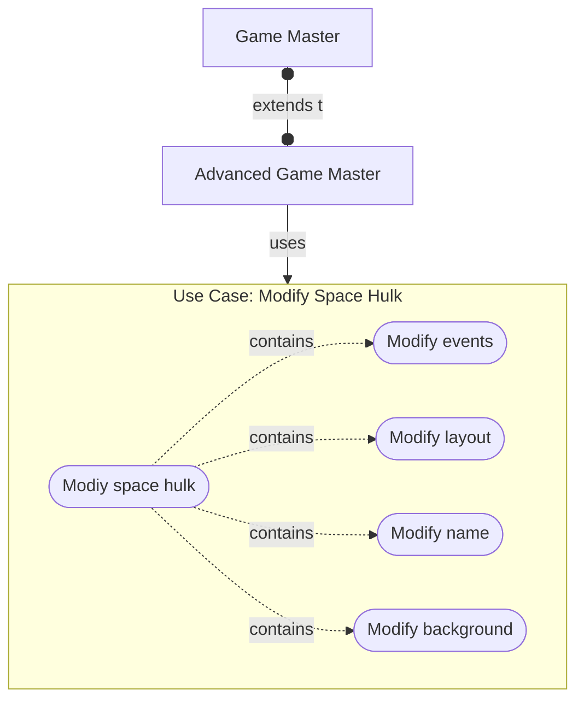
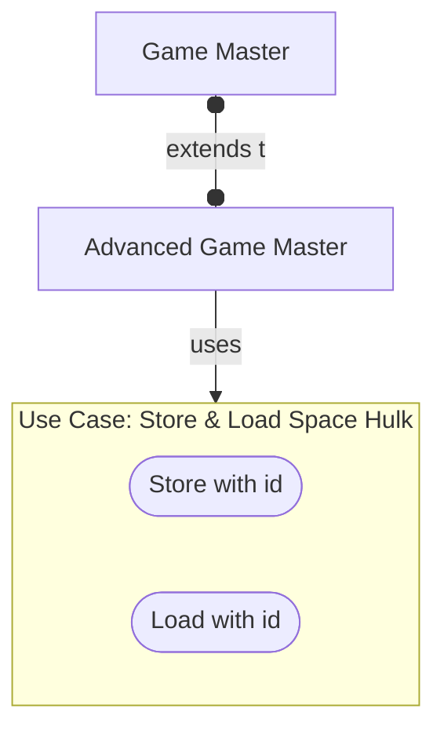
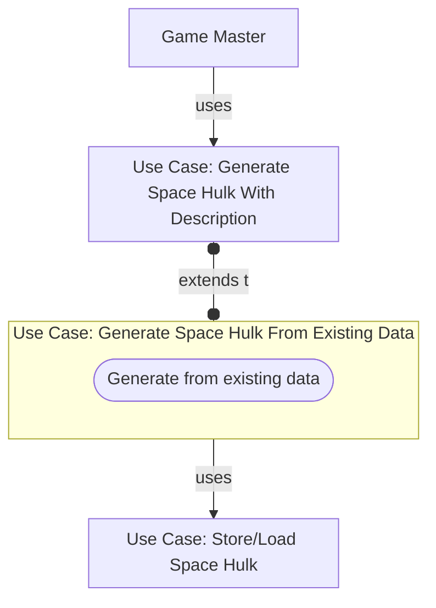
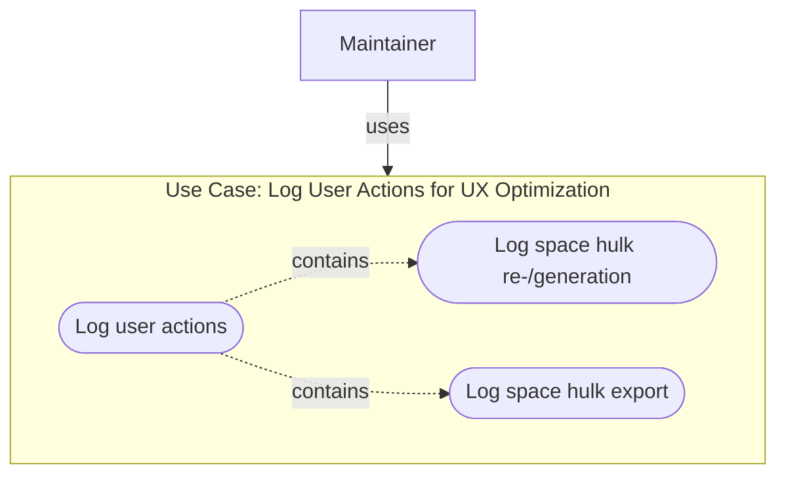

# Use cases

## Table of contents

- [Users](#users)
- [Basic Use Cases](#basic-use-cases)
  - [Generate Space Hulks](#generate-space-hulks)
  - [Review Space Hulks](#review-space-hulks)
  - [Export Space Hulks](#export-space-hulks)
- [Advanced Use Cases](#advanced-use-cases)
  - [Modify Space Hulks](#modify-space-hulks)
  - [Store & Load Space Hulks](#store--load-space-hulks)
  - [Generate Space Hulks from set of existing space hulks](#generate-space-hulks-from-set-of-existing-space-hulks)
  - [Log user actions to optimize UX](#log-user-actions-to-optimize-ux)

## Users

- _Game Master_: Wants to generate a ready-to-use space hulk for his gaming group.
- _Advanced Game Master_: Wants to customize the generated space hulk by adding a background story, a name and fitting
  to fit it to the needs of the gaming group.
- _Maintainer_: Wants to build up a database of good space hulks & provide the best UX with the solution.

## Basic Use Cases

### Generate Space Hulks

### Review Space Hulks

### Export Space Hulks

## Advanced Use Cases

### Modify Space Hulks

### Store & Load Space Hulks

### Generate Space Hulks from set of existing space hulks

Idea: Store "good" space hulks that have been exported by the users and either reuse them or, if the db is big enough,
train an AI model to generate descriptions & names based on the existing ones.

### Log user actions to optimize UX

