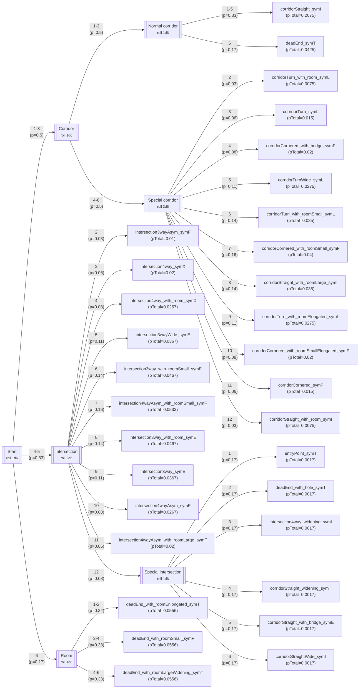

```mermaid
flowchart LR
    start[[Start\n<small>roll 1d6</small>]] --"1-3\n(p=0.5)"--> corridor[[Corridor\n<small>roll 1d6</small>]]

    corridor --"1-3\n(p=0.5)"--> normalCorridor[[Normal corridor\n<small>roll 1d6</small>]]
    corridor --"4-6\n(p=0.5)"--> specialCorridor[[Special corridor\n<small>roll 2d6</small>]]

    normalCorridor --"1-5\n(p=0.83)"--> corridorStraight_symI["corridorStraight_symI\n(pTotal=0.2075)"]
    normalCorridor --"6\n(p=0.17)"--> deadEnd_symT["deadEnd_symT\n(pTotal=0.0425)"]

    specialCorridor --"2\n(p=0.03)"--> corridorTurn_with_room_symL["corridorTurn_with_room_symL\n(pTotal=0.0075)"]
    specialCorridor --"3\n(p=0.06)"--> corridorTurn_symL["corridorTurn_symL\n(pTotal=0.015)"]
    specialCorridor --"4\n(p=0.08)"--> corridorCornered_with_bridge_symF["corridorCornered_with_bridge_symF\n(pTotal=0.02)"]
    specialCorridor --"5\n(p=0.11)"--> corridorTurnWide_symL["corridorTurnWide_symL\n(pTotal=0.0275)"]
    specialCorridor --"6\n(p=0.14)"--> corridorTurn_with_roomSmall_symL["corridorTurn_with_roomSmall_symL\n(pTotal=0.035)"]
    specialCorridor --"7\n(p=0.16)"--> corridorCornered_with_roomSmall_symF["corridorCornered_with_roomSmall_symF\n(pTotal=0.04)"]
    specialCorridor --"8\n(p=0.14)"--> corridorStraight_with_roomLarge_symI["corridorStraight_with_roomLarge_symI\n(pTotal=0.035)"]
    specialCorridor --"9\n(p=0.11)"--> corridorTurn_with_roomElongated_symL["corridorTurn_with_roomElongated_symL\n(pTotal=0.0275)"]
    specialCorridor --"10\n(p=0.08)"--> corridorCornered_with_roomSmallElongated_symF["corridorCornered_with_roomSmallElongated_symF\n(pTotal=0.02)"]
    specialCorridor --"11\n(p=0.06)" --> corridorCornered_symF["corridorCornered_symF\n(pTotal=0.015)"]
    specialCorridor --"12\n(p=0.03)"--> corridorStraight_with_room_symI["corridorStraight_with_room_symI\n(pTotal=0.0075)"]

    start --"4-5\n(p=0.33)"--> intersection[[Intersection\n<small>roll 2d6</small>]]

    intersection --"2\n(p=0.03)"--> intersection3wayAsym_symF["intersection3wayAsym_symF\n(pTotal=0.01)"]
    intersection --"3\n(p=0.06)"--> intersection4way_symX["intersection4way_symX\n(pTotal=0.02)"]
    intersection --"4\n(p=0.08)"--> intersection4way_with_room_symX["intersection4way_with_room_symX\n(pTotal=0.0267)"]
    intersection --"5\n(p=0.11)"--> intersection3wayWide_symE["intersection3wayWide_symE\n(pTotal=0.0367)"]
    intersection --"6\n(p=0.14)"--> intersection3way_with_roomSmall_symE["intersection3way_with_roomSmall_symE\n(pTotal=0.0467)"]
    intersection --"7\n(p=0.16)"--> intersection4wayAsym_with_roomSmall_symF["intersection4wayAsym_with_roomSmall_symF\n(pTotal=0.0533)"]
    intersection --"8\n(p=0.14)"--> intersection3way_with_room_symE["intersection3way_with_room_symE\n(pTotal=0.0467)"]
    intersection --"9\n(p=0.11)"--> intersection3way_symE["intersection3way_symE\n(pTotal=0.0367)"]
    intersection --"10\n(p=0.08)"--> intersection4wayAsym_symF["intersection4wayAsym_symF\n(pTotal=0.0267)"]
    intersection --"11\n(p=0.06)"--> intersection4wayAsym_with_roomLarge_symF["intersection4wayAsym_with_roomLarge_symF\n(pTotal=0.02)"]
    intersection --"12\n(p=0.03)"--> specialIntersection[[Special intersection\n<small>roll 1d6</small>]]

    specialIntersection --"1\n(p=0.17)"--> entryPoint_symT["entryPoint_symT\n(pTotal=0.0017)"]
    specialIntersection --"2\n(p=0.17)"--> deadEnd_with_hole_symT["deadEnd_with_hole_symT\n(pTotal=0.0017)"]
    specialIntersection --"3\n(p=0.17)"--> intersection4way_widening_symI["intersection4way_widening_symI\n(pTotal=0.0017)"]
    specialIntersection --"4\n(p=0.17)"--> corridorStraight_widening_symT["corridorStraight_widening_symT\n(pTotal=0.0017)"]
    specialIntersection --"5\n(p=0.17)"--> corridorStraight_with_bridge_symE["corridorStraight_with_bridge_symE\n(pTotal=0.0017)"]
    specialIntersection --"6\n(p=0.17)"--> corridorStraightWide_symI["corridorStraightWide_symI\n(pTotal=0.0017)"]

    start --"6\n(p=0.17)"--> room[[Room\n<small>roll 1d6</small>]]

    room --"1-2\n(p=0.34)"--> deadEnd_with_roomEnlongated_symT["deadEnd_with_roomEnlongated_symT\n(pTotal=0.0556)"]
    room --"3-4\n(p=0.33)"--> deadEnd_with_roomSmall_symF["deadEnd_with_roomSmall_symF\n(pTotal=0.0556)"]
    room --"4-6\n(p=0.33)"--> deadEnd_with_roomLargeWidening_symT["deadEnd_with_roomLargeWidening_symT\n(pTotal=0.0556)"]
```
